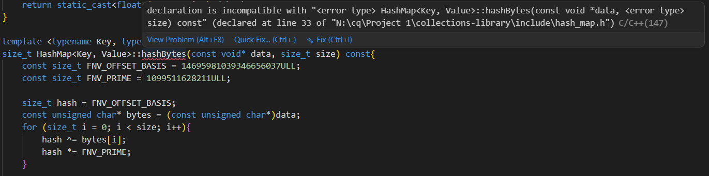

Date: July 10

Duration: 120 minutes

Goal: creating a hashmap.h file and write the first few methods and constructor for hash map including default constructor and parameterized constructor .

Problem Encountered:
How should the hashing mechanism be designed so that the same implementation works for every primitive data type?
Whether to use malloc() or calloc() for allocating the bucket array.
Whether the load factor should be checked before insertion or after insertion.

What I tried:
Designed a separate hashBytes() function implementing the FNV-1a hashing algorithm to operate on a stream of bytes instead of individual primitive types.
Decided to use a function hashKey() and hashbyte() which converts the key into a byte stream and then generate a hashcode for it 
Compared malloc() and calloc() for bucket allocation and chose calloc() since every bucket must initially point to nullptr.
Analysed the insertion process and changed the implementation to check the load factor before creating a new node.

Outcome:
Implemented both constructors of the Hash Map.
Implemented size(), capacity(), isEmpty() and loadFactor().
Implemented the FNV-1a hashing algorithm for primitive data types.
Separated hashing into hashKey() and hashBytes() making the design extensible for user-defined types.

Date: July 10

Duration: 120 minutes

Goal:to complete the implementation of hash_map for primitive data types by writing the remaining methods including insert(),clear(),get (),remove(),findnode().

Problem Encountered:
How should rehashing be performed without creating duplicate nodes or calling insert() recursively?
How should nodes be removed safely from a collision chain while maintaining the linked list?
How can memory deallocation logic be reused by both clear() and the destructor instead of duplicating code?
How should deep copying be implemented while preserving the collision chain order?

What I tried:
Implemented rehashing by allocating a new bucket array and moving existing nodes directly into their new buckets instead of recreating them.
Used two pointers (previous and current) to correctly remove nodes from the linked list.
Extracted the common node deletion logic into a reusable freeMemory() helper and used it inside clear() and the destructor.
Implemented a reusable copyFrom() helper to perform deep copying, which is then used by both the copy constructor and copy assignment operator.

Outcome:
implemented findNode(), contains(), get(), insert(), rehash() and remove().
Implemented clear() and freeMemory() to centralize memory management.
Completed the Version 1 implementation of the Hash Map for primitive data types using separate chaining, manual memory management and FNV-1a hashing.

Date:july 10

Duration: 60 minutes

problem encountered:
got a bug in my hash map.tpp which made my code appear red when i was trying to write hashkey and hashbyte methods 

what i tried :
tried to check whether hashkey and hashbyte are defined in hashmap.h or not ,checked their spellinf error 
researched about what would be the cause .

outcome:
after researching for some time i found the header file #include <cstddef> was missing from hash_map.h 
which was causing error due tp use of size_t as soon as i included it the bug was resolved .

