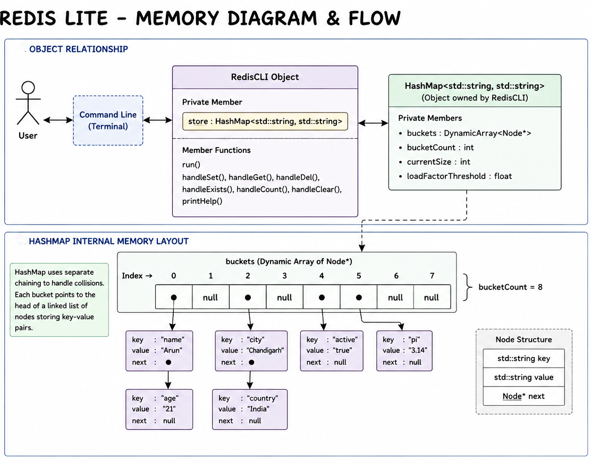

## Section 1 – Specific Issue

Today's work involved completing the Redis Lite design proposal, implementing its first version, and writing unit tests for both the Hash Map and Redis Lite. I had to decide whether Redis Lite should be templated or use `std::string` keys and values, how commands should be handled, and how private methods could be unit tested without exposing the internal implementation.

---

## Section 2 – Failed Attempt

Initially, I considered making Redis Lite a template and automatically converting user commands to uppercase, but after researching CLI behavior, I decided to keep it as a `std::string`-based application with case-sensitive commands. During testing, I first tried accessing private methods using a friend function, but since that approach did not work as expected, I temporarily made the handler methods public to complete unit testing. I also encountered occasional method redefinition errors, which were resolved by cleaning and rebuilding the project.

---

## Section 3 – Memory Diagram

---

## Section 4 – Code Reference

Completed the Redis Lite design proposal by documenting its architecture, API, and design decisions. Implemented the first version of `redis_lite.h` and `redis_lite.cpp`, including the command-processing loop and all supported commands. Wrote comprehensive unit tests for Hash Map and Redis Lite, corrected Google Test fixture usage, and verified the implementation using CMake, Google Test, and Valgrind.

---

## Section 5 – Learning Reflection

Today's work strengthened my understanding of designing an application on top of existing data structures rather than making everything generic. I learned to make design decisions based on the application's requirements, such as using `std::string` for CLI input and relying on the Hash Map for memory management. I also gained valuable experience writing unit tests, handling access control during testing, debugging build issues, and validating the correctness of the implementation through automated testing.
