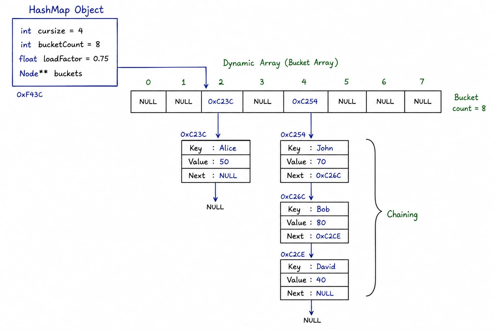

## Section 1 – Specific Issue

The primary design challenges encountered today were deciding the overall architecture of the `HashMap` and justifying each design decision before implementation.

The major issues were:

- Selecting an appropriate collision resolution strategy (Separate Chaining vs Open Addressing).
- Designing a generic hash function capable of supporting both primitive and user-defined data types.
- Determining a suitable maximum load factor for automatic rehashing.
- Choosing the appropriate memory allocation strategy (`malloc()` vs `calloc()`) under the project constraint of not using `new` and `delete`.

---

## Section 2 – Failed Attempt

Initially, I considered implementing **Open Addressing (Linear Probing)** because it requires less memory and avoids allocating linked-list nodes. However, after studying its behavior, I realized that deletion becomes significantly more complicated due to tombstone management, clustering degrades lookup performance as the table fills, and probing logic increases implementation complexity. Therefore, I decided not to use this approach.

For hashing, I initially explored common string hashing algorithms such as **djb2** and **FNV-1a** directly. Although these algorithms work well for primitive types and strings, they do not naturally support user-defined data types. After further research and discussion, I redesigned the hashing mechanism using a **recursive variadic template approach**, where complex objects are recursively decomposed into their primitive members, each primitive member is hashed individually, and the resulting hash values are combined into a single hash code.

I was also uncertain whether the maximum load factor should be **1.0** or **0.75**. While `std::unordered_map` commonly uses a load factor close to `1.0`, it assumes a highly optimized hashing implementation. Since this project implements every component from scratch, I selected **0.75** to reduce collision chains and maintain better average-case performance.

Regarding memory allocation, I compared both `malloc()` and `calloc()`. Initially I intended to use only one allocation function throughout the implementation. After analyzing their behavior, I concluded that a hybrid approach is more suitable: `calloc()` for bucket allocation because every bucket pointer should initially be `nullptr`, and `malloc()` for collision chain nodes because node members are immediately initialized after allocation, making zero-initialization unnecessary.

---

## Section 3 – Memory Diagram

---

## Section 4 – Code Reference

No implementation code was written today.

Today's work focused on designing the complete `HashMap` architecture, including:

- Public API.
- Internal memory representation.
- Rule of Three.
- Complexity analysis.
- Collision management strategy.
- Recursive generic hashing framework.
- Load factor and rehashing policy.
- Memory allocation strategy.
- Exception handling design.
- Trade-offs and implementation limitations.

---

## Section 5 – Learning Reflection

So today i got to learn about chaining vs probing tradeoff , choosing correct hash function is important and  how recursive generic hashing can be designed using variadic template
I also learned about load factor what its tradeoff between 0.75 and 1.0
And one more thing the importance of const in encapsulating the methods to prevent them from accidental  modification .

